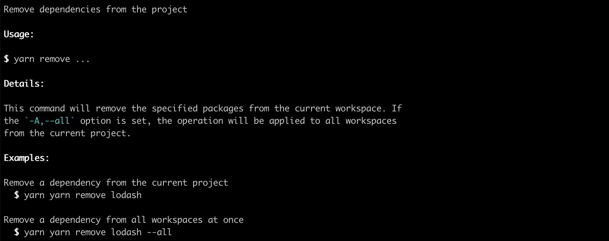
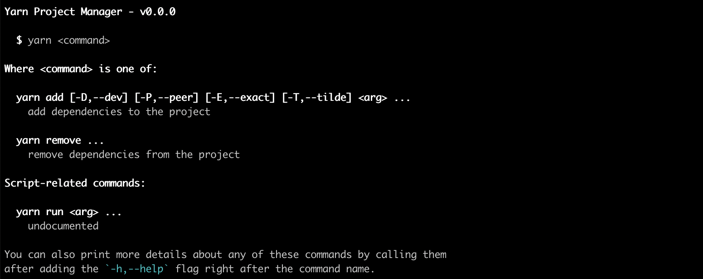

#  Clipanion

> Type-safe CLI library with no dependencies

[]() []() [](https://github.com/yarnpkg/berry)

## Installation

```
yarn add clipanion
```

## Why

  - Clipanion supports advanced typing mechanisms
  - Clipanion supports nested commands (`yarn workspaces list`)
  - Clipanion supports transparent option proxying without `--` (for example `yarn dlx eslint --fix`)
  - Clipanion supports all option types you could think of (including negations, batches, ...)
  - Clipanion offers a [Yup](https://github.com/jquense/yup) integration for increased validation capabilities
  - Clipanion generates an optimized state machine out of your commands
  - Clipanion generates good-looking help pages out of the box

Clipanion is used in [Yarn](https://github.com/yarnpkg/berry) with great success.

## Recommended Usage

**Note:** This syntax assumes you have some way to compile decorators. TypeScript supports them via the `experimentalDecorators` setting, and Babel via the `@babel/plugin-proposal-decorators` plugin.

In essence you just need to declare a class that extends the `Command` abstract class, and implement the `execute` method. This function will then be called by Clipanion and its return value will be set as exit code by the engine (by default the exit code will be 0, which means success).

Options and command paths are set using the `@Command` decorators, unless you're in an environment that doesn't support them (in which case check the next section to see how to use the fallback syntax). Because you're in a regular class, you can even set default values to your options as you would with any other property!

```ts
import {Cli, Command} from 'clipanion';
import * as yup from 'yup';

class GreetCommand extends Command {
    @Command.Boolean(`-v,--verbose`)
    public verbose: boolean = false;

    @Command.String(`--name`)
    public name?: string;

    @Command.Path(`greet`)
    async execute() {
        if (typeof this.name === `undefined`) {
            this.context.stdout.write(`You're not registered.\n`);
        } else {
            this.context.stdout.write(`Hello, ${this.name}!\n`);
        }
    }
}

class FibonacciCommand extends Command {
    @Command.String({required: true})
    public a!: number;

    @Command.String({required: true})
    public b!: number;

    @Command.Path(`fibo`)
    async execute() {
        // ...
    }

    static schema = yup.object().shape({
        a: yup.number().integer(),
        b: yup.number().integer(),
    })
}

const cli = new Cli({
    binaryLabel: `My Utility`,
    binaryName: `bin`,
    binaryVersion: `1.0.0`,
});

cli.register(GreetCommand);
cli.register(FibonacciCommand);

cli.runExit(process.argv.slice(2), {
    ...Cli.defaultContext,
});
```

## Fallback Usage

In case the primary syntax isn't available (for example because you want to avoid any kind of transpilation), a fallback syntax is available:

```js
class GreetCommand extends Command {
    async execute() {
        // ...
    }
}

GreetCommand.addPath(`greet`);

GreetCommand.addOption(`boolean`, Command.Boolean(`-v,--verbose`));
GreetCommand.addOption(`name`, Command.String(`--name`));
```

Note that in this case the option variables never get assigned default values, so they may be undefined within the `execute` block.

## Decorators

The `optionNames` parameters all indicate that you should put there a comma-separated list of option names (along with their leading `-`). For example, `-v,--verbose` is a valid parameter.

#### `@Command.Path(segment1: string, segment2: string, ...)`

Specifies through which CLI path should trigger the command. This decorator can only be set on the `execute` function itself, as it isn't linked to specific options.

Note that you can add as many paths as you want to a single command. By default it will be connected on the main entry point (empty path), but if you add even one explicit path this behavior will be disabled. If you still want the command to be available on both a named path and as a default entry point (for example `yarn` which is an alias for `yarn install`), simply call the decorator without segments:

```ts
@Command.Path(`install`)
@Command.Path()
async execute() {
  // ...
}
```

#### `@Command.String({required?: boolean})`

Specifies that the command accepts a positional argument. By default it will be required, but this can be toggled off.

#### `@Command.String(optionNames: string)`

Specifies that the command accepts an option that takes an argument.

#### `@Command.Boolean(optionNames: string)`

Specifies that the command accepts a boolean flag as an option.

#### `@Command.Array(optionNames: string)`

Specifies that the command accepts a set of string arguments (`--arg value1 --arg value2`).

## Command Help Pages

Clipanion automatically adds support for the `-h` option to all the commands that you define. The information printed will come from the `usage` property attached to the class. For example, the following command:

```ts
class YarnAdd extends Command {
    static usage = Command.Usage({
        description: `remove dependencies from the project`,
        details: `
            This command will remove the specified packages from the current workspace. If the \`-A,--all\` option is set, the operation will be applied to all workspaces from the current project.
        `,
        examples: [[
            `Remove a dependency from the current project`,
            `yarn remove lodash`,
        ], [
            `Remove a dependency from all workspaces at once`,
            `yarn remove lodash --all`,
        ]],
    });
}
```

Will generate something like this:



Note that the inline code blocks will be automatically highlighted.

## General Help Page

In order to support using the `-h` option to list the commands available to the application, just register a new command as such:

```ts
class HelpCommand extends Command {
  @Command.Path(`--help`)
  @Command.Path(`-h`)
  async execute() {
    this.context.stdout.write(this.cli.usage(null));
  }
}
```

This will print a block similar to the following:



## Composition

Commands can call each other by making use of their `cli` internal property:

```ts
class FooCommand extends Command {
    @Command.Path(`foo`)
    async execute() {
        this.context.stdout.write(`Hello World\n`);
    }
}

class BarCommand extends Command {
    @Command.Path(`bar`)
    async execute() {
        this.cli.run([`foo`]);
    }
}
```

## Contexts

Commands share what is called a *context*. Contexts are a set of values defined when calling the `run` function from the CLI instance that will be made available to the commands via `this.context`. The default context contains properties for `stdin`, `stdout`, and `stderr`, but you can easily define a custom context that extends the default one:

```ts
import {BaseContext, Command} from 'clipanion';

type MyContext = BaseContext & {
    cwd: string;
};

class PwdCommand extends Command<MyContext> {
    async execute() {
        this.context.stdout.write(`${this.context.cwd}\n`);
    }
}

const cli = Cli.from<MyContext>([
    PwdCommands,
]);

cli.runExit(process.argv.slice(2), {
    ...Cli.defaultContext,
    cwd: process.cwd(),
});
```

Note that the context must be fully defined when calling `run` and `runExit` on the main CLI instance, but can be omitted or only partially specified when using `this.cli.run` (in which case only the specified fields will be changed).

## License (MIT)

> **Copyright © 2019 Mael Nison**
>
> Permission is hereby granted, free of charge, to any person obtaining a copy of this software and associated documentation files (the "Software"), to deal in the Software without restriction, including without limitation the rights to use, copy, modify, merge, publish, distribute, sublicense, and/or sell copies of the Software, and to permit persons to whom the Software is furnished to do so, subject to the following conditions:
>
> The above copyright notice and this permission notice shall be included in all copies or substantial portions of the Software.
>
> THE SOFTWARE IS PROVIDED "AS IS", WITHOUT WARRANTY OF ANY KIND, EXPRESS OR IMPLIED, INCLUDING BUT NOT LIMITED TO THE WARRANTIES OF MERCHANTABILITY, FITNESS FOR A PARTICULAR PURPOSE AND NONINFRINGEMENT. IN NO EVENT SHALL THE AUTHORS OR COPYRIGHT HOLDERS BE LIABLE FOR ANY CLAIM, DAMAGES OR OTHER LIABILITY, WHETHER IN AN ACTION OF CONTRACT, TORT OR OTHERWISE, ARISING FROM, OUT OF OR IN CONNECTION WITH THE SOFTWARE OR THE USE OR OTHER DEALINGS IN THE SOFTWARE.
